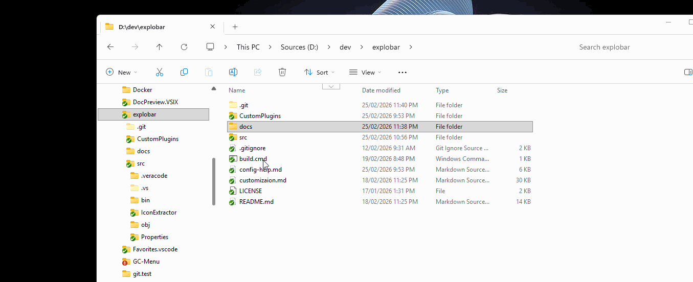

# Explobar

A keyboard-driven toolbar extension for Windows Explorer that eliminates the friction between file navigation and productivity tools.

## The Problem

Windows Explorer offers virtually no customization beyond appearance. When you need to open a terminal, launch an editor, or run a script on files you're viewing, you face constant friction: copying paths, switching windows, typing commands, or navigating through nested context menus. Every action requires multiple intermediate steps that break your flow.

While brilliant tools like QTTabBar have extended Windows functionality dramatically, they have become increasingly fragile due to being tightly coupled with Explorer internals. Microsoft's dramatic changes to these internals in Windows 11 have rendered QTTabBar (and similar tools) unreliable. Thus in some cases QTTabBar is unable to even start.

## The Solution

Explobar provides immediate access to your productivity tools right where you work - in Explorer. Press a keyboard shortcut, and a toolbar appears at your cursor with instant access to any command, application, or custom action. No copying paths. No switching windows. No mouse hunting. Just navigation → selection → action.



## Key Principles

**Zero Friction UX**

- Tools appear instantly where your focus is
- Selected files and current folder are automatically available
- Single keypress or click executes any action
- No intermediate steps between thought and execution

**Customization for Everyone**

- **Simple:** Edit a YAML file to add buttons and shortcuts
- **Powerful:** Write .NET plugins for complex workflows
- Both approaches work together seamlessly

**Safe & Reliable**

- Runs in its own process - Explorer crashes won't affect it, and it won't crash Explorer
- No external dependencies except Explorer itself
- No services, no elevated privileges required
- Works entirely through standard Windows automation

**Zero-Friction Deployment**

- Just an executable and `YamlDotNet.dll`
- Run it once, configure once, forget it
- WinGet and Chocolatey packages coming soon

## Features

- 🎯 **Keyboard-Triggered Toolbar** - Appears on-demand at cursor position
- ⚡ **Stock Actions** - Built-in operations for common tasks
- 🔧 **Custom Commands** - Execute any application with automatic path injection
- ⌨️ **Global Shortcuts** - Assign hotkeys to any toolbar action
- 🔌 **Plugin System** - Extend with .NET assemblies for complex workflows
- 📂 **Favorites & Quick Access** - Folders and applications at your fingertips
- 📜 **Explorer History** - Automatically tracked, always available
- 🎨 **Icon Browser** - Preview and extract icons from any file (shell32.dll, imageres.dll, etc.)
- 🔄 **Live Configuration** - Changes apply immediately, no restart

## Installation

1. Download from [GitHub Releases](https://github.com/oleg-shilo/explobar/releases)
2. Extract `Explobar.exe` and `YamlDotNet.dll`
3. Run `Explobar.exe` (runs in system tray)

**Requirements:** Windows 10/11, .NET Framework 4.8.1+

## Quick Start

1. **Launch:** Run Explobar.exe (minimizes to system tray)
2. **Navigate:** Open any folder in Windows Explorer
3. **Activate:** Press `Shift+Escape` (configurable) OR click the embedded Explorer button
4. **Execute:** Click any button or press `Escape` to dismiss

The toolbar appears where your cursor is, with full context of your current folder and selected files.

### Explorer Launch Button

Explobar automatically embeds a small clickable button in each Explorer window for instant toolbar access:

- **Location:** Appears in the upper area of each Explorer window (default: 200 pixels from left edge)
- **Function:** Click to launch the toolbar at your cursor position
- **Multi-Tab Support:** Works with Windows 11 multi-tab Explorer, adapting as you switch tabs
- **Customization:** Position can be adjusted or button can be disabled entirely (see Configuration)

This provides a mouse-friendly alternative to the keyboard shortcut, keeping toolbar access always visible and just one click away.

## Basic Configuration

Configuration file: `%LocalAppData%\Explobar\toolbar-items.yaml`

### Minimal Example

```yaml
Settings: 
  ButtonSize: 24 
  ShortcutKey: Shift+Escape
Applications:
  - Path: notepad.exe
  - Name: Calculator
    Path: calc.exe
  - Name: Terminal
    Path: wt.exe
    Arguments: '-d %c%'
Items:
 - Path: '{new-file}'           # Built-in: create text file
 - Path: '{new-folder}'         # Built-in: create folder
 - Path: '{separator}'          # Visual separator
 - Path: 'notepad.exe'          # Custom: launch notepad 
   Arguments: '%f%'             # Pass selected file 
   Tooltip: 'Edit in Notepad'
```

### Configuration Elements

**Settings:**

- `ButtonSize` - Icon size in pixels (default: 24)
- `ShortcutKey` - Keyboard shortcut to show toolbar (default: Shift+Escape)
- `HistorySize` - Number of recent folders to remember (default: 10)
- `ShowConsoleAtStartup` - Show debug console on startup (default: false)
- `DisableExplorerLaunchButton` - Hide the embedded Explorer button (default: false)
- `ExplorerButtonXPosition` - Horizontal position of Explorer button from left edge in pixels (default: 200)

**Items:** Toolbar buttons (stock or custom)

**Favorites:** Quick-access folder list

**Applications:** Quick-launch application list (object format with Name, Path, Arguments, WorkingDir)

### Placeholders

- `%f%` - First selected file (quoted)
- `%c%` - Current directory (quoted)
- `%Variable%` - Any environment variable

### Stock Buttons

- `{new-tab}` - New Explorer tab
- `{new-file}` - New text file in current folder
- `{new-folder}` - New folder in current folder
- `{from-clipboard}` - Navigate to path from clipboard
- `{recent}` - Recently visited folders menu
- `{favorites}` - Favorite folders menu
- `{applications}` - Favorite applications menu
- `{props}` - File/folder properties dialog
- `{icons}` - Icon browser - browse and extract icons from any file
- `{separator}` - Visual separator
- `{app-config}` - Configuration and tools menu

### Example: Terminal Integration

```yaml
Items:
- Path: 'wt.exe' 
  Arguments: '-d %c%' 
  Icon: 'cmd.exe' 
  Tooltip: 'Windows Terminal' 
  Shortcut: 'Ctrl+Alt+T'
```

### Example: Hidden, Shortcut-Only Command

```yaml
Items:
- Path: 'calc.exe' 
  Shortcut: 'Ctrl+Alt+C' 
  SystemWide: true      # Works even when Explorer isn't focused 
  Hidden: true          # No toolbar button, keyboard-only
```

### Example: Customizing Explorer Button

```yaml
Settings:
  ExplorerButtonXPosition: 150    # Move button to 150px from left edge
  # DisableExplorerLaunchButton: true  # Uncomment to hide the button entirely
```

For complete configuration reference, see [docs\customization.md](docs\customization.md).

## Icon Browser

The Icon Browser allows you to preview and extract icons from any file containing icon resources (executables, DLLs, icon files).

**Access:**
- Toolbar button: `{icons}` 
- System tray: Right-click → "Icon Browser"
- App Config menu: `{app-config}` → "Preview icons"

**Features:**
- Browse icons from system files (shell32.dll, imageres.dll, etc.)
- Extract icons from executables and DLLs
- View icon index numbers for configuration
- Recent file history for quick access
- Copy icon paths and indices for use in toolbar configuration

**Common Icon Sources:**
- `shell32.dll` - Classic Windows icons (folders, files, system)
- `imageres.dll` - Modern Windows icons (Windows 7+)
- `sud.dll` - User account and security icons
- Any `.exe`, `.dll`, or `.ico` file

## Plugin Development

Extend Explobar with custom .NET plugins for workflows that need more than launching applications.

### Two Approaches

**1. C# Source Files (Recommended for Quick Development)**
- Write C# code in `.cs` files
- Auto-compiled at runtime
- No build tools required
- Perfect for simple plugins and quick prototyping
- Template: Generate via System Tray → Development → Create Plugin

**2. Pre-compiled DLLs (For Complex Projects)**
- Traditional .NET development
- Full IDE support and debugging
- Better for complex workflows
- Target .NET Framework 4.7.2

### Quick Example

```c#
using Explobar;
using System.Windows.Forms;

public class HelloButton : CustomButton
{
    public HelloButton()
    {
        IconIndex = 1;
        IconPath = "shell32.dll";
        Tooltip = "Say Hello";
    }

    public override void OnClick(ClickArgs args)
    {
        MessageBox.Show($"Hello from: {args.Context.RootPath}");
    }
}
```

### Configuration

```yaml
Items:
  # C# source file (auto-compiled)
  - Path: '{C:\Plugins\HelloButton.cs}'
  
  # Pre-compiled DLL
  - Path: '{C:\Plugins\MyTools.dll,HelloButton}'
```

**Important:** Plugin paths must be enclosed in curly brackets `{}`.

For complete plugin development guide, see [customization.md](customization.md).

## Troubleshooting

**Toolbar doesn't appear**

- Ensure Explorer window has focus
- Check shortcut key isn't conflicting with other applications. Use PowerToys to resolve any shortkey conflicts. 
- Verify mouse cursor is over Explorer window

**Configuration changes not applying**

- Check YAML syntax (use online validator)
- Review console for errors: Set `ShowConsoleAtStartup: true`
- Restart Explobar if necessary

**Toolbar state issues**

- Use "Restart Explorer" from `{app-config}` menu or system tray to reset Explorer process
- This can resolve issues with window detection or stuck toolbar states

**Plugin not loading**

- Verify path uses curly brackets: `{path\to\plugin.dll}`
- Check plugin targets .NET Framework 4.7.2
- Enable console to see detailed error messages
- For C# source plugins, check logs for compilation errors

## Architecture Highlights

- **Separate Process:** Explobar runs independently - no risk to Explorer stability
- **COM Automation:** Safe, documented API for Explorer interaction
- **Low-Level Keyboard Hook:** System-wide shortcut monitoring
- **Dynamic Plugin Loading:** Reflection-based assembly loading at runtime
- **Zero Services:** No background services, no system modifications

## System Tray

Right-click tray icon for quick access:

- **Icon Browser** - Browse and extract icons from system files
- **Edit Configuration** - Open toolbar-items.yaml in Notepad
- **Development** - Developer tools submenu
  - **Create Plugin** - Generate plugin template file
  - **Show/Hide Console** - Toggle debug console window
  - **Open Logs** - Open log file directory
- **Restart Explorer** - Restart Windows Explorer process
- **About** - Version and copyright information
- **Exit** - Close Explobar

## Limitations and Constraints

### Platform Requirements

Will arguebly work with all Windows but some features (e.g. NewTab) are specifically targeting Windows 10/11 only.

### Windows 11 Multi-Tab Detection

When an Explorer window contains multiple tabs open to folders with same names, it's impossible to reliably detect which tab is active due to Windows Explorer API limitations.

*Impact:* Will show a message box asking to close the duplicated tabs.

*Workaround:* Enable "Display the full path in the title bar" in Folder Options to improve tab detection reliability, or close duplicate/similarly-named tabs

### Path Navigation Constraints

**Hash (#) Character:**

- Explorer's COM API (`Navigate2`) fails with paths containing `#`
- Explobar automatically falls back to `explorer.exe`, which opens the path in a new window instead of navigating the current tab.

### Activation Requirements

- Explorer window must have mouse cursor over it to activate toolbar
- Explorer window must have focus for context detection
- Toolbar appears at cursor position, so cursor must be within Explorer bounds

### Single Instance

- Only one instance of Explobar can run at a time
- Attempting to launch a second instance shows a warning message
- Allows configuration to be managed in one place but prevents multi-profile setups

### Keyboard Shortcuts

- Uses low-level keyboard hook for global shortcut monitoring
- Potential conflicts with other applications using the same shortcuts
- System-wide shortcuts (`SystemWide: true`) always active, even when Explorer doesn't have focus
- No support for shortcut combinations with more than one modifier + key (e.g., `Ctrl+Shift+Alt+Key` not supported)

### Configuration

- YAML syntax errors prevent configuration from loading (falls back to default config)
- Configuration changes apply when toolbar is next shown (not instantly for currently visible toolbar)
- No built-in YAML validation - must use external tools to validate syntax
- Duplicate shortcuts silently ignored (first one wins, others logged to console)

### Plugin System

- Plugin paths **must** be enclosed in curly brackets: `{path\to\plugin.dll}`
- Plugins must inherit from `CustomButton` and implement `ICustomButton`
- Plugin assemblies are loaded via reflection and cannot be unloaded without restarting Explobar
- COM object separation errors possible when plugins interact with stale Explorer window references
- No hot-reload support - configuration changes require showing toolbar again
- **C# Source Plugins:** C# files (`.cs`) are automatically compiled at runtime
- **Template Available:** A comprehensive plugin template (`MyCustomButton.cs`) is included in the release package
- **Language Support:** C# 7.3 targeting .NET Framework 4.7.2
- **Compilation Errors:** Check logs (console or log files) for C# compilation errors

## Links

- **GitHub:** https://github.com/oleg-shilo/explobar
- **Issues:** https://github.com/oleg-shilo/explobar/issues
- **Documentation:** [customization.md](customization.md)

## Credits

- **Author:** Oleg Shilo
- **YAML Parser:** [YamlDotNet](https://github.com/aaubry/YamlDotNet)
- **Icon Extraction:** [IconExtractor](https://github.com/TsudaKageyu/IconExtractor)

---

**Explobar** - Friction-free productivity for Windows Explorer

**Note:** The application is configured as a Windows Application. Console window is hidden by default but can be toggled via system tray menu or `ShowConsoleAtStartup` setting for debugging.
