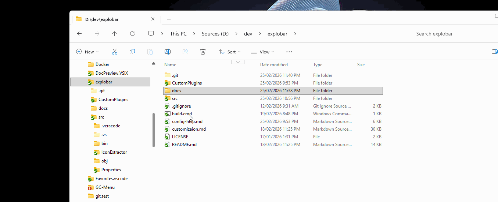

# Explobar: fixing a surprisingly annoying Windows dev problem

If you do most of your work in a terminal, this post may feel only mildly relevant.

But if your day often starts in Windows Explorer, the gap between browsing files and acting on them can be surprisingly clumsy.

You open a folder, inspect files, jump between project directories, right-click things, copy paths, open terminals, launch editors, and repeat the same small rituals dozens of times a day. None of these steps is difficult on its own. Together, they quietly drain momentum.

That is the problem Explobar is built to solve.

## The Windows Explorer gap

Windows Explorer is still the default file system workspace for many developers on Windows. Not for everything, of course, but for plenty of real work:

- opening a repo you just cloned
- browsing generated files
- inspecting logs, assets, build output, or config
- comparing folders
- jumping into the right directory before launching tools

This is especially common in what you could call a *gemba* workflow: you start where the work physically is, in the file system, and act from there.

The issue is not that Explorer is bad at browsing files. The issue is that acting on those files usually takes too many steps. Open Terminal. Copy path. Paste path. Launch an editor. Run a helper script. Open properties. Create a file. Create a folder. Jump to a recent location.

Explorer makes these actions possible, but not fluid.

## A note on QTTabBar

It is worth acknowledging QTTabBar here because, for years, it was the tool that made Explorer genuinely usable for power users and developers.

It proved that Explorer could become far more productive with the right extensions around it.

The problem is that this approach has become much less viable. Windows changed the Explorer hosting model, especially around Windows 11, and that effectively broke the assumptions tools like QTTabBar depended on. What used to be a powerful extension point turned into a fragile maintenance problem.

So this is not a criticism of QTTabBar. It is simply a recognition that Windows moved on in a way that practically killed one of the best Explorer productivity tools many of us relied on.

## Terminal-first developers already have a solution

It is worth being precise here: if you are already living in a terminal, this problem is almost irrelevant.

Shell users have fast navigation, aliases, scripts, history, fuzzy finders, editor integration, and automation built into the workflow. The handoff from "I am looking at something" to "I want to act on it" is already very short.

Explobar is not trying to replace that world.

It is for developers who work on Windows and still use Explorer as a usual starting point: people who navigate visually first, then want immediate access to the tools and commands that matter in that context.

## What Explobar does

Explobar adds a keyboard-driven toolbar to Windows Explorer.

When you trigger it, a toolbar appears right where you are working, with awareness of the current folder and selected files. From there, you can launch apps, run custom commands, open recent locations, trigger built-in file actions, or wire in your own automation.



Conceptually, Explobar covers some of the same ground as Explorer right-click shell extensions: it gives you context actions for the files and folders in front of you.

But it is dramatically faster in practice because it is not competing with Explorer's own context menus or with the hundreds of third-party apps that keep adding entries there. Instead of digging through an overloaded menu tree, you get a focused toolbar built around your workflow.

And that is the key difference: you are in complete control of what those context actions are. You can keep just a few essential buttons, or define as many actions as your workflow needs.

In practice, that means less of this:

- copy path
- switch windows
- type the command again
- dig through menus

And more of this:

- navigate > select > trigger

That is the core idea: reduce the distance between seeing something and doing something.

Just as importantly, Explobar avoids the integration model that made older Explorer extensions fragile. It is not a shell extension tightly embedded into Explorer. It is a simple, standalone, zero-dependency app running outside the Explorer process.

That design choice matters. If Explorer changes internally, Explobar is far less exposed than tools that live inside Explorer itself.

## Why this is interesting

Explobar is lightweight in concept, but it opens up a very useful layer of customisation.

At the centre of the app is a very practical idea: the toolbar is just a set of buttons and actions fully defined by the user in a declarative config file.

You can keep it simple with a YAML config and a few buttons for Terminal, Notepad, recent folders, or file actions. That alone removes plenty of friction.

But the model does not stop at static launchers. If you need something more advanced, like calculating hashes for all selected files, you can attach custom logic through a small .NET assembly or even a single C# `.cs` file.

That is what makes it appealing for developers:

- easy to start
- fast to adapt
- powerful if you want to grow into it

## Who should care

Explobar is a good fit if:

- you develop on Windows
- Explorer is part of your normal daily workflow
- you often launch tools from folders or file selections
- you want less context-switching between browsing and doing

If your workflow already begins and ends in PowerShell, Bash, or Windows Terminal, the benefit may be limited.

If your workflow regularly begins in Explorer, Explobar makes a lot more sense.

## Final thought

A lot of developer tooling focuses on editors, terminals, and cloud workflows. That makes sense. But local file-system work is still part of the day for many Windows developers.

Explobar is a focused answer to that reality. It does not try to replace your terminal or your editor. It just removes friction from the place where many Windows workflows still begin: Explorer.

If this sounds like your workflow, the project is on GitHub: [https://github.com/oleg-shilo/explobar](https://github.com/oleg-shilo/explobar)

And installation on Windows is as simple as:

```powershell
winget install explobar
```
